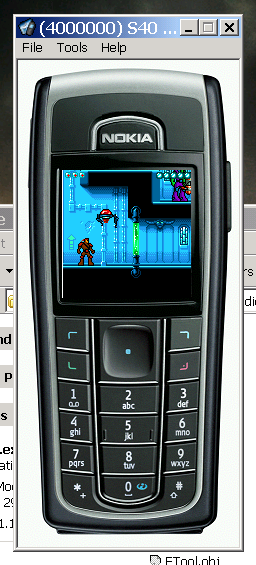

# Lethal Metal

Lethal Metal is a jump'n'run (platform) game written in Java and J2ME, targeting Nokia Series 40 and other J2ME-enabled cellphones. The gameplay resembles Blizzard Black Thorne, with a balanced mixture of puzzles, combat and story elements.

The purpose was to develop a commercial quality J2ME game, a platform game engine and a set of tools (map editor, sprite editor), having in mind the specifics of cellphone platforms: small package size (64kb) and small heap memory (200kb).

This is a [mirror of the project released on SourceForge](https://sourceforge.net/projects/lethalmetal/) in 2005.

## History
Lethal Metal project began in march 2003 as a commercial project under the code-name Cyberninja. The game was developed in the spare time, from scratch, in less than eight months. A playable mockup was available in august 2003, the graphics were created in autumn 2003 and a fully playable version was available in march 2004. It was pitched for a possible investor around that time, but it failed to secure funding.

The project then gathered dust as the lead game designer lost interest (unfortunately) and was ressurected in order to release it as opensource in 2005.

## Features

Brief list of engine capabilities:
* player character with fluid animations (over 70 animation frames, including running, jumping, crouching, climbing ladders and edges, firing, hiding)
* 3 types of enemies, with the possibility to easily remove or add, depending on the phone capabilities (jar size, heap)
* AI for the enemies, based on state machines
* powerup items (health boxes, ammo)
* traps, elevators, elevator terminals, triggers
* various props
* eye-candy physics (not extremely realistic, but fun and easy to tweak)
* support to create basic narrative
* localization
* map and sprite editors

## Setup&Build&Run

**Note that the SDKs required to build are no longer available, obsolete and/or may only work on Windows XP.**

In order to compile the project, you need to:
* download and install the Nokia 3510i SDK from http://www.forum.nokia.com/main/0,,034-10,00.html (24Mb)
  (you will need to register on Nokia Forum site to obtain the serial number for the SDK)
* download and install the Sun WTK 2.1 from http://java.sun.com/products/j2mewtoolkit/download-2_1.html (16Mb)
* download and install the JDK from http://java.sun.com/j2se/1.5.0/download.jsp (55Mb)
* go to ${HOME}/dev/ant/Nokia3510i_opt and open build.xml; modify SDK_HOME.dir to point to the Nokia 3510i SDK path
  and wtk.home to point to the Sun WTK path
* go to ${HOME} and open build.bat, modify the JAVA_HOME to point to the JDK location
* open a console and change directory to ${HOME}
* type build run Nokia3510i_opt LethalMetal EN
* enjoy! :)

Builds may be run in an emulator, most phone SDKs provide one. 

To upload to device, you will need a data cable + phone manager software or a WAP connection.

In order to compile the project specific tools, you will need the Borland C++Builder 6 (version 5 might work as well). 

Most recent builds of the tools may be found at [Piron Games GameToolkit released page](https://github.com/stefandee/gametoolkit/releases)

## Known Issues/Limitations

For the moment, Lethal Metal has only one version, the master version, for Nokia 3510i. The version is also tuned for the 3510i screen resolution, 96x65. It may be possible to run it on other Nokia devices (Nokia Series 30/40, even E50) "as it is", but because most of them have high resolution, the game will be displayed in the top-left corner. 

The main problem is the fact that a cellphone game must be tailored specifically for each device, given the fact that devices have different screen size, heap memory, processing power, graphics api specifics, bugs in hardware, various firmware versions for one device. 

Rendering is done through Nokia DirectGraphic, this should be replaced when targeting other phones SDKs.

I tried to make the engine as modular as possible to address most of the problems above and also tried to design a build system/framework to deal with the huge number of versions (depending on manufacturer, midp 1.0/2.0) usually emerging during such a project.

Several architectures are not supported by the java game engine (places where tile collisions are only left and the player collides from right, this will cause teleportation). Such map configurations should be avoided.

You may jump from an elevator and hang on a edge, while the elevator is moving behind you. I like it as a feature, tho :)

The player may stand on an edge, with only 1 pixel on the solid ground and the rest in the air. Also, recovery may come with the same visual effect. This could be further tweaked but well, I'm too lazy :)

Animations are not perfect, it's pretty difficult to tweak them using the current action system.

Sometimes, weird combinations result combining a mine and a player getting hit by a bullet. Not a bug, tho.

The editors may have small issues, as they were not the target of testing :)

There is only one map. That's ok. You should do the rest of them :>

The sprite editor could use several big enhancements regarding the sprite concept. Hint: a sprite is composed of many zones that repeat.

## Credits
  
* Stefan "Karg" Dicu - engine programming and tools
* Bogdan "Dahn" Hodorog - build system and additional programming
* Andrei Fantana - game and level design
* Iulian Agapie - original Cyberninja art assets 

## The Road Ahead (ToDo)

* Command mode for tools.
* Make the build-data.xml to build the data using the command mode of the tools.
* Some more levels (another 5 would be cool).
* More ports, with MIDP1.0 and MIDP2.0 functionalities.
* Sounds.

## Media

## Licenses

Code license:
https://www.gnu.org/licenses/gpl-3.0.en.html

Graphics and audio assets:
https://creativecommons.org/licenses/by-nc-sa/4.0/
